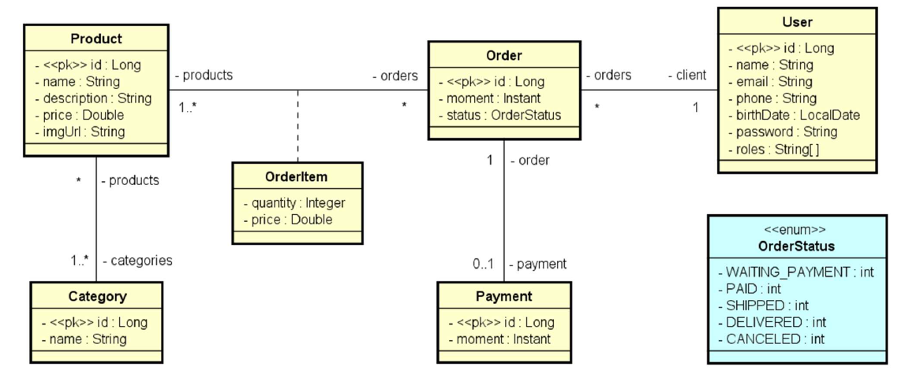

<div align="left">
  <h1><strong>DS Commerce - Login e controle de acesso</strong></h1>
</div>

## Índice

- [Sobre](#sobre)
- [Casos de uso](#casos-de-uso)
- [Como executar o projeto](#como-executar-o-projeto)
- [Tecnologias Utilizadas](#tecnologias-utilizadas)
- [Contribuições](#contribuições-)
- [Implementando o spring security](#spring-security)

## Sobre

O sistema deve manter um cadastro de usuário, produtos e suas categorias. Cada
usuário possui nome, email, telefone, data de nascimento e uma senha de acesso. Os
dados dos produtos são: nome, descrição, preço e imagem. O sistema deve apresentar
um catálogo de produtos, os quais podem ser filtrados pelo nome do produto. A partir
desse catálogo, o usuário pode selecionar um produto para ver seus detalhes e para
decidir se o adiciona a um carrinho de compras. O usuário pode incluir e remover itens
do carrinho de compra, bem como alterar as quantidades de cada item. Uma vez que o
usuário decida encerrar o pedido, o pedido deve então ser salvo no sistema com o status
de "aguardando pagamento". Os dados de um pedido são: instante em que ele foi salvo,
status, e uma lista de itens, onde cada item se refere a um produto e sua quantidade no
pedido. O status de um pedido pode ser: aguardando pagamento, pago, enviado,
entregue e cancelado. Quando o usuário paga por um pedido, o instante do pagamento
deve ser registrado. Os usuários do sistema podem ser clientes ou administradores,
sendo que todo usuário cadastrado por padrão é cliente. Usuários não identificados
podem se cadastrar no sistema, navegar no catálogo de produtos e no carrinho de
compras. Clientes podem atualizar seu cadastro no sistema, registrar pedidos e visualizar
seus próprios pedidos. Usuários administradores tem acesso à área administrativa onde
pode acessar os cadastros de usuários, produtos e categorias.Conforme o modelo conceitual abaixo:

<div align="center">
  
</div>

[Voltar ao Índice](#índice)

## Casos de uso

| Caso de uso         | Visão geral                                                                                             | Visão geral    |
|---------------------|---------------------------------------------------------------------------------------------------------|----------------|
| Manter produtos     | CRUD de produtos, podendo filtrar itens pelo nome                                                       | Somente Admin  |
| Manter categorias   | CRUD de categorias, podendo filtrar itens pelo nome                                                     | Somente Admin  |
| Manter usuários     | CRUD de usuários, podendo filtrar itens pelo nome                                                       | Somente Admin  | 
| Gerenciar carrinho  | Incluir e remover itens do carrinho de compras, bem como alterar as quantidades do produto em cada item | Público        |
| Consultar catálogo  | Listar produtos disponíveis, podendo filtrar produtos pelo nome                                         | Público        |
| Sign up             | Cadastrar-se no sistema                                                                                 | Público        |
| Login               | Efetuar login no sistema                                                                                | Público        |                             
| Registrar pedido    | Salvar no sistema um pedido a partir dos dados do carrinho de compras informado                         | Usuário logado |
| Atualizar perfil    | Atualizar o próprio cadastro                                                                            | Usuário logado |
| Visualizar pedidos  | Visualizar os pedidos que o próprio usuário já fez                                                      | Usuário logado | 
| Registrar pagamento | Salvar no sistema os dados do pagamento de um pedido                                                    | Somente Admin  |
| Reportar pedidos    | Relatório de pedidos, podendo ser filtrados por data                                                    | Somente Admin  |

[Voltar ao Índice](#índice)

## Como executar o projeto

1. Clonar o projeto a partir do GitHub

   ````https://github.com/felipeam10/dscommerce.git````

2. Em sua IDE de preferência, abra o projeto a partir do diretório que o mesmo foi clonado. 

3. Importe as Collections do postman a partir do Link : https://www.getpostman.com/collections/a5929fa46ba2b6a991d4
4. Ou pegue as collections atualizadas no final do projeto:  

    - src/main/resources/DSCommerce Prod.postman_collection.json
    - src/main/resources/DSCommerce Auth.postman_environment.json       

5. Execute os [Casos de uso](#casos-de-uso)

[Voltar ao Índice](#índice)

## Spring security

1. Modelo de domínio User-Role

<div align="center">
  
</div>

2. Dependências
```xml
<dependency>
	<groupId>org.springframework.boot</groupId>
	<artifactId>spring-boot-starter-security</artifactId>
</dependency>

<dependency>
	<groupId>org.springframework.security</groupId>
	<artifactId>spring-security-test</artifactId>
	<scope>test</scope>
</dependency>

<dependency>
	<groupId>org.springframework.security</groupId>
	<artifactId>spring-security-oauth2-authorization-server</artifactId>
</dependency>

<dependency>
	<groupId>org.springframework.boot</groupId>
	<artifactId>spring-boot-starter-oauth2-resource-server</artifactId>
</dependency>
```

3. Checklist Spring security

    - GrantedAuthority
    - UserDetails
    - UserDetailsService
    - UsernameNotFoundException


4. Valores de configuração
```properties
    security.client-id=${CLIENT_ID:myclientid}
    security.client-secret=${CLIENT_SECRET:myclientsecret}
    security.jwt.duration=${JWT_DURATION:86400}
    cors.origins=${CORS_ORIGINS:http://localhost:3000,http://localhost:5173}
```

5. Checklist OAuth2 JWT password grant
    - Implementação customizada do password grant
    - Authorization server
    - Resource server


6. Controle de acesso por perfil e rota

## Tecnologias Utilizadas

Antes de iniciar, assegure-se de ter o ambiente Java corretamente configurado em sua máquina. Abaixo você tem a relação das tecnologias que foram utilizadas no processo de desenvolvimento do projeto.

| Tecnologia                  | Versão                                     |
| --------------------------- |--------------------------------------------|
| Sistema Operacional         | Windows 10                                 |
| Linguagem de Programação (JDK) | java 17.0.7 2023-04-18 LTS                 
| Framework                   | Spring Boot 3.1.10                         |
| Banco de Dados              | H2 Database                                |
| IDE                         | IntelliJ IDEA 2023.1.1 (Community Edition) |
| Ferramenta de Teste de API  | Postman v10.17.4                           |

[Voltar ao Índice](#índice)

## Contribuições 

Caso tenha uma contribuição que possa melhorar este projeto, por favor, abra uma issue ou um pull request, seguindo os passos abaixo.

1. Crie um 'Fork' do projeto
2. Crie uma 'Branch' para sua modificação (`git checkout -b feature/yourFeatureName`)
3. Faça o 'Commit' das suas mudanças (`git commit -m 'Add some yourFeatureName'`)
4. 'Push' para a 'Branch' (`git push origin feature/yourFeatureName`)
5. Abra uma 'Pull Request'

[Voltar ao Índice](#índice)

