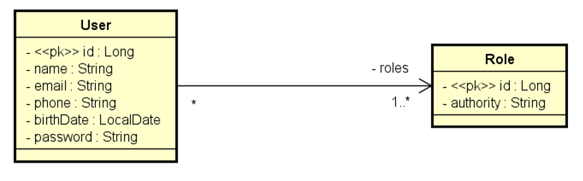

<div align="left">
  <h1><strong>DS Commerce</strong></h1>
</div>

## Índice

- [Sobre](#sobre)
- [Casos de uso](#casos-de-uso)
- [Como executar o projeto](#como-executar-o-projeto)
- [Tecnologias Utilizadas](#tecnologias-utilizadas)
- [Contribuições](#contribuições-)

## Sobre

Trata-se de um sistema de vendas (Sale) e vendedores (Seller). Cada venda está para um vendedor, e um
vendedor pode ter várias vendas. Conforme o diagrama de classes abaixo:

<div align="center">
  
</div>

[Voltar ao Índice](#índice)

## Casos de uso

- **Relatório de vendas**

    1. [IN] O usuário informa, opcionalmente, data inicial, data final e um trecho do nome do vendedor.

    2. [OUT] O sistema informa uma listagem paginada contendo id, data, quantia vendida e nome do
       vendedor, das vendas que se enquadrem nos dados informados.

       **Informações complementares**

        -  Se a data final não for informada, considerar a data atual do sistema. Para instanciar a data atual,

       utilize o comando:

        - Se a data inicial não for informada, considerar a data de 1 ano antes da data final. P

        - Se o nome não for informado, considerar o texto vazio.

        - Dica: receba todos os dados como String no controller, e faça os tratamentos


- **Sumário de vendas por vendedor**

    1. [IN] O usuário informa, opcionalmente, data inicial, data final.

    2. [OUT] O sistema informa uma listagem contendo nome do vendedor e soma de vendas deste vendedor
       no período informado.

  **Informações complementares:**

    -  As mesmas do caso de uso Relatório de vendas

[Voltar ao Índice](#índice)

## Como executar o projeto

1. Clonar o projeto a partir do GitHub

   ````https://github.com/felipeam10/desafio-consulta-vendas````

2. Em sua IDE de preferência, abra o projeto a partir do diretório que o mesmo foi clonado. 

3. Importe as Collections do postman a partir do Link : https://www.getpostman.com/collections/a5929fa46ba2b6a991d4

4. Execute os [Casos de uso](#casos-de-uso)

[Voltar ao Índice](#índice)

## Tecnologias Utilizadas

Antes de iniciar, assegure-se de ter o ambiente Java corretamente configurado em sua máquina. Abaixo você tem a relação das tecnologias que foram utilizadas no processo de desenvolvimento do projeto.

| Tecnologia                  | Versão                                     |
| --------------------------- |--------------------------------------------|
| Sistema Operacional         | Windows 10                                 |
| Linguagem de Programação (JDK) | java 17.0.7 2023-04-18 LTS                 
| Framework                   | Spring Boot 3.1.10                         |
| Banco de Dados              | H2 Database                                |
| IDE                         | IntelliJ IDEA 2023.1.1 (Community Edition) |
| Ferramenta de Teste de API  | Postman v10.17.4                           |

[Voltar ao Índice](#índice)

## Contribuições 

Caso tenha uma contribuição que possa melhorar este projeto, por favor, abra uma issue ou um pull request, seguindo os passos abaixo.

1. Crie um 'Fork' do projeto
2. Crie uma 'Branch' para sua modificação (`git checkout -b feature/yourFeatureName`)
3. Faça o 'Commit' das suas mudanças (`git commit -m 'Add some yourFeatureName'`)
4. 'Push' para a 'Branch' (`git push origin feature/yourFeatureName`)
5. Abra uma 'Pull Request'

[Voltar ao Índice](#índice)